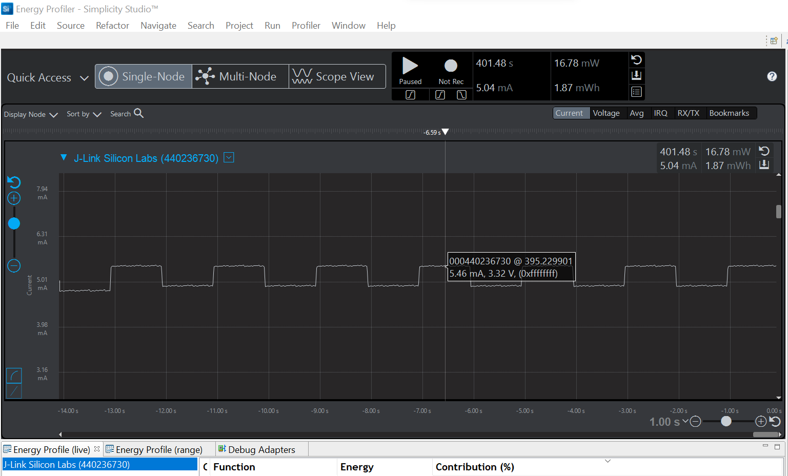

Please include your answers to the questions below with your submission, entering into the space below each question
See [Mastering Markdown](https://guides.github.com/features/mastering-markdown/) for github markdown formatting if desired.

**1. How much current does the system draw (instantaneous measurement) when a single LED is on with the GPIO pin set to StrongAlternateStrong?**
   Answer: The current drawn by the system was found to be 5.46mA.
   

**2. How much current does the system draw (instantaneous measurement) when a single LED is on with the GPIO pin set to WeakAlternateWeak?**
   Answer: The current drawn by the system was found to be 5.28mA.
   

**3. Is there a meaningful difference in current between the answers for question 1 and 2? Please explain your answer, 
referencing the [Mainboard Schematic](https://www.silabs.com/documents/public/schematic-files/WSTK-Main-BRD4001A-A01-schematic.pdf) and [AEM Accuracy](https://www.silabs.com/documents/login/user-guides/ug279-brd4104a-user-guide.pdf) section of the user's guide where appropriate. Extra credit is avilable for this question and depends on your answer.**
   Answer: No, there is no meaningful difference in current between answers for question 1 and 2. The GPIO Drive Strengths set for StrongAlternateStrong and WeakAlternateWeak modes are 10mA and 1mA respectively. Since the load is minimal when a single LED is on, the current drawn in both modes do not have a meaningful difference between them. 
   The current drawn by a single LED was found to be approximately 0.52mA. This was done by taking the difference between instantaneous current measurements in the ON and OFF duty cycles. Since this value of 0.52mA falls within both drive strengths of StrongAlternateStrong and WeakAlternateWeak, the difference is negligible.  

**4. With the WeakAlternateWeak drive strength setting, what is the average current for 1 complete on-off cycle for 1 LED with an on-off duty cycle of 50% (approximately 1 sec on, 1 sec off)?**
   Answer: The average current for 1 complete on-off duty cycle for 1 LED with 50% duty cycle was found to be 4.99mA.
   

**5. With the WeakAlternateWeak drive strength setting, what is the average current for 1 complete on-off cycle for 2 LEDs (both on at the time same and both off at the same time) with an on-off duty cycle of 50% (approximately 1 sec on, 1 sec off)?**
   Answer: The average current for 1 complete on-off duty cycle for 2 LEDs with 50% duty cycle was found to be 5.28mA
   